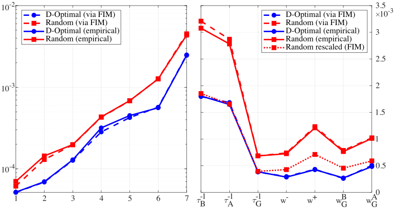
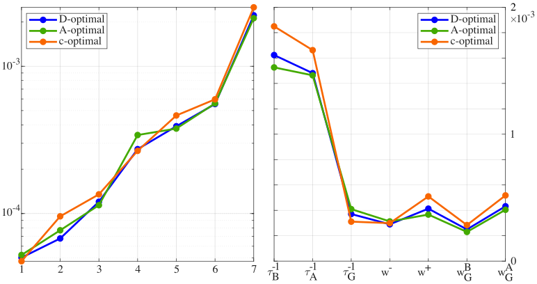
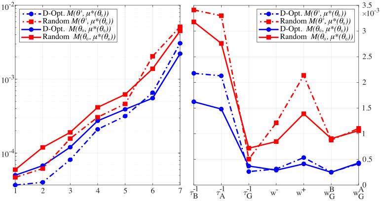

# Optimal input design for parameter estimation in linear controlled stochastic systems with retinal applications

This repository contains the MATLAB code to reproduce the numerical experiments presented in:

> **"Optimal input design for parameter estimation in linear controlled stochastic systems with retinal applications"**
>
> L. Sacchelli, B. Cessac, L. Pronzato  
> *Preprint 2026*

## Citation

If you use this code in your work, please cite the following reference:

```
@article{SacchelliCessacPronzato2026,
  title={Optimal input design for parameter estimation in linear controlled stochastic systems with retinal applications},
  author={Sacchelli, L. and Cessac, B. and Pronzato, L.},
  journal={Preprint},
  year={2026}
}
```

This code is distributed under the MIT License.

---

## Experiments

### How to run

From inside the main folder, run the following scripts to execute the different numerical experiments. Parameters in the scripts correspond to the values used in the paper.

### 1. Optimal input selection (1D & 2D)
These scripts compute the D-optimal controls.

* **1D Case:** D-optimal design on a 1D retinal model.
    ```matlab
    Retina_1D_Input_Selection.m
    ```

<p align="center">
  
</p>

* **2D Case:** D-optimal design on a 2D retinal model.

    ```matlab
    Retina_2D_Input_Selection.m
    ```
    
<p align="center">
  
</p>

---

### 2. Parameter estimation
Simulates the stochastic system and recovers the parameters. The whole experiment is reproduced 150 in order to gather empirical variance of the estimator. More images on this experiment at the end.
```matlab
Retina_1D_Parameter_Estimation.m
```

<p align="center">
  
</p>

Uncertainty after $K=100$ experiments. Left: principal axes of the uncertainty ellipsoid in log-scale (square root of the eigenvalues of the covariance matrix); right: standard deviation for each parameter. Blue: $D$-optimal design; red: random design. Plain line: obtained from empirical covariance matrix; dashed line: obtained from the FIM. The close match between the empirical and predicted values illustrates the accuracy of the asymptotic normal as an approximation of the distribution of the ML estimator. The red dotted line on the right has been obtained by rescaling the red dashed line by a factor of $1/\sqrt{3}$, indicating the expected standard deviations achieved for $K=300$ experiments with random designs.

### 3. Objective Function Comparison
Analysis of the optimality criteria. This script compares different input designs and their impact on the objective function's shape and convexity.
```matlab
Retina_1D_Objective_function_comparison.m
```

<p align="center">
  
</p>

Effect of design criterion ($K=100$). Left: principal axes of the uncertainty ellipsoid in log-scale (square root of the eigenvalues of the covariance matrix); right: standard deviation for each parameter. Blue: $D$-optimal design; green: $A$-optimal design; orange: $c$-optimal design (with $c=(0,0,1,0,0,0,0)$, i.e., minimization of the uncertainty on $\tau_G^{-1}$). Overall, the difference in performance of the three optimal design is marginal. 


### 4. Robustness: wrong parameter assumption

Investigates the performance and sensitivity of the optimal design when the prior knowledge of the system parameters is inaccurate.

<p align="center">
  
</p>

Comparison of the FIM at the nominal parameter $\theta_0$ and a different value $\theta'$ ($K=100$) for the optimal distribution $\mu^*(\theta_0)$. Left: principal axes of the uncertainty ellipsoid in log-scale; right: standard deviation for each parameter. Blue: D-optimal design; red: random design. Plain line: FIM for the nominal parameter where the optimal design is computed; dashed line: FIM at a perturbation of this nominal value. In this example, we picked at random $\theta'$ such that the relative differences ($(\theta'_i-\theta_i)/\theta_i$) are actually relatively large $(-0.423,   0.280,   -0.061,    0.223,    0.478,    0.038,    0.001)$. Despite this difference, there is still a significant gain between the random and the optimal design, even if it has been designed for a different value of $\theta$.


